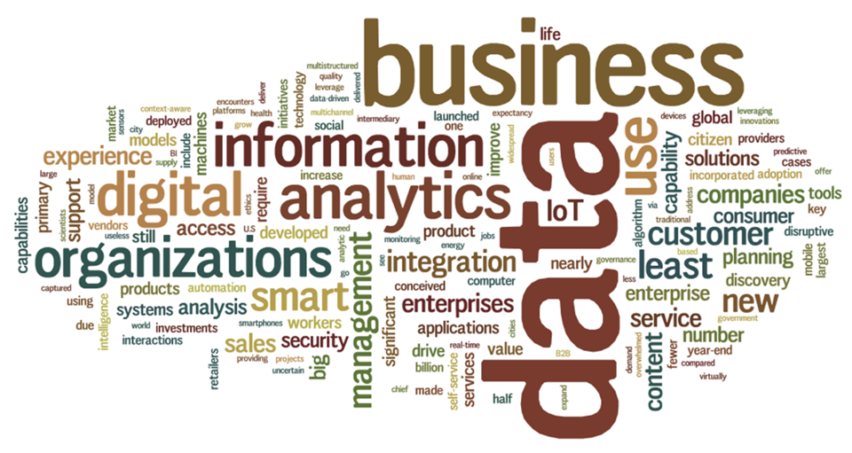

Gartner: 101 Information and Analytics Predictions Through 2020
========================================================
author: François Pelletier
date: 28 mai 2015

(TL;DR)
========================================================

- Gartner est une firme de recherche marketing dans le domaine de l'informatique et de l'administration. 
- Ils publient fréquemment des prédictions sur la suituation des entreprises par rapport à l'adoption des nouvelles technologies. 
- Je trouvais intéressant de vous partager leurs travaux question d'y trouver des nouvelles idées. 
- De plus, c'est un de leurs rares articles qui ne fait pas que *plugger* des compagnies.

========================================================

Distribution
========================================================

<!-- html table generated in R 3.1.3 by xtable 1.7-4 package -->
<!-- Mon May 25 23:26:26 2015 -->
<table border=1>
<tr> <th>  </th> <th> Fréquence </th>  </tr>
  <tr> <td align="right"> Business Function  </td> <td align="right">  17 </td> </tr>
  <tr> <td align="right"> Core Analytics  </td> <td align="right">   8 </td> </tr>
  <tr> <td align="right"> Core Information  </td> <td align="right">  27 </td> </tr>
  <tr> <td align="right"> Digital Business/Commerce  </td> <td align="right">   8 </td> </tr>
  <tr> <td align="right"> Industry  </td> <td align="right">  16 </td> </tr>
  <tr> <td align="right"> Information Infrastructure and Technology  </td> <td align="right">  25 </td> </tr>
   </table>

Business Function 
========================================================

<!-- html table generated in R 3.1.3 by xtable 1.7-4 package -->
<!-- Mon May 25 23:26:26 2015 -->
<table border=1>
<tr> <th>  </th> <th> Sujet </th> <th> Freq </th>  </tr>
  <tr> <td align="right"> 1 </td> <td> CRM Sales  </td> <td align="right">   3 </td> </tr>
  <tr> <td align="right"> 2 </td> <td> Customer Service  </td> <td align="right">   3 </td> </tr>
  <tr> <td align="right"> 3 </td> <td> Supply Chain Planning  </td> <td align="right">   3 </td> </tr>
  <tr> <td align="right"> 4 </td> <td> Workforce  </td> <td align="right">   3 </td> </tr>
  <tr> <td align="right"> 5 </td> <td> Digital Marketing  </td> <td align="right">   2 </td> </tr>
  <tr> <td align="right"> 6 </td> <td> Enterprise Resource Planning  </td> <td align="right">   1 </td> </tr>
  <tr> <td align="right"> 7 </td> <td> IT Operations  </td> <td align="right">   1 </td> </tr>
  <tr> <td align="right"> 8 </td> <td> IT Procurement and Asset Management  </td> <td align="right">   1 </td> </tr>
   </table>

CRM Sales 
========================================================

<!-- html table generated in R 3.1.3 by xtable 1.7-4 package -->
<!-- Mon May 25 23:26:26 2015 -->
<table border=1>
<tr> <th>  </th> <th> Phrase </th>  </tr>
  <tr> <td align="right"> 1 </td> <td> By 2017, 15% of sales organizations will use crowdsourced benchmarks to design their sales incentive compensation management (ICM) plans.  </td> </tr>
  <tr> <td align="right"> 2 </td> <td> By 2017, 50% of B2B selling organizations will invest in predictive analytics solutions for prospect qualification, opportunity automation, forecasting automation and renewal management.  </td> </tr>
  <tr> <td align="right"> 3 </td> <td> By 2017, 65% of sales organizations will use smartphones to drive user adoption and improve data quality for sales force automation (SFA) systems.  </td> </tr>
   </table>

Customer Service 
========================================================

<!-- html table generated in R 3.1.3 by xtable 1.7-4 package -->
<!-- Mon May 25 23:26:26 2015 -->
<table border=1>
<tr> <th>  </th> <th> Phrase </th>  </tr>
  <tr> <td align="right"> 1 </td> <td> By 2017, 33% of all customer service interactions will still require the support of a human intermediary.  </td> </tr>
  <tr> <td align="right"> 2 </td> <td> By 2018, 50% of agent interactions will be influenced by real-time analytics.  </td> </tr>
  <tr> <td align="right"> 3 </td> <td> By 2018, 75% of social-only customer service agents will be blended into the customer service agent pool.  </td> </tr>
   </table>

Supply Chain Planning 
========================================================

<!-- html table generated in R 3.1.3 by xtable 1.7-4 package -->
<!-- Mon May 25 23:26:26 2015 -->
<table border=1>
<tr> <th>  </th> <th> Phrase </th>  </tr>
  <tr> <td align="right"> 1 </td> <td> By 2018, only 10% of global enterprises will have 30% or more, of their planning capability in the respond planning category.  </td> </tr>
  <tr> <td align="right"> 2 </td> <td> By 2018, 90% of demand-driven value network (DDVN) leaders in consumer products will leverage downstream consumption as pull signals to drive near-term upstream supply execution.  </td> </tr>
  <tr> <td align="right"> 3 </td> <td> By 2018, 90% of Gartner's top 25 supply chain companies will have deployed a planning system of record to support at least Stage 3 planning maturity.  </td> </tr>
   </table>

Workforce 
========================================================

<!-- html table generated in R 3.1.3 by xtable 1.7-4 package -->
<!-- Mon May 25 23:26:26 2015 -->
<table border=1>
<tr> <th>  </th> <th> Phrase </th>  </tr>
  <tr> <td align="right"> 1 </td> <td> By 2018, only 10% of business operations planning and review cycles will leverage self-service, data-driven workforce insights.  </td> </tr>
  <tr> <td align="right"> 2 </td> <td> By 2020, 20% of organizations will include employee engagement improvement as a shared performance objective for HR and IT groups. </td> </tr>
  <tr> <td align="right"> 3 </td> <td> By 2018, nearly 50% of learning providers will look to streamline the learner's experience by providing context-aware capability.  </td> </tr>
   </table>

Digital Marketing 
========================================================

<!-- html table generated in R 3.1.3 by xtable 1.7-4 package -->
<!-- Mon May 25 23:26:26 2015 -->
<table border=1>
<tr> <th>  </th> <th> Phrase </th>  </tr>
  <tr> <td align="right"> 1 </td> <td> By 2017, 50% of consumer product investments will be redirected to customer experience innovations.  </td> </tr>
  <tr> <td align="right"> 2 </td> <td> By 2017, a significant disruptive digital business, conceived by a computer algorithm, will be launched.  </td> </tr>
   </table>

Enterprise Resource Planning 
========================================================

<!-- html table generated in R 3.1.3 by xtable 1.7-4 package -->
<!-- Mon May 25 23:26:26 2015 -->
<table border=1>
<tr> <th>  </th> <th> Phrase </th>  </tr>
  <tr> <td align="right"> 1 </td> <td> Through 2018, 20% of large enterprises will deliver real-time visibility into financial performance, using in-memory computing (IMC) with their finance systems.  </td> </tr>
   </table>

IT Operations 
========================================================

<!-- html table generated in R 3.1.3 by xtable 1.7-4 package -->
<!-- Mon May 25 23:26:26 2015 -->
<table border=1>
<tr> <th>  </th> <th> Phrase </th>  </tr>
  <tr> <td align="right"> 1 </td> <td> By 2017, 25% of I&amp;O organizations will invest in discrete business value dashboard tools as the primary means of communicating to the business.  </td> </tr>
   </table>

IT Procurement and Asset Management 
========================================================

<!-- html table generated in R 3.1.3 by xtable 1.7-4 package -->
<!-- Mon May 25 23:26:26 2015 -->
<table border=1>
<tr> <th>  </th> <th> Phrase </th>  </tr>
  <tr> <td align="right"> 1 </td> <td> By 2018, at least 15% of industry-leading companies will inadvertently gift digital knowledge to "IT vendors" who use it to compete against the </td> </tr>
   </table>

Core Analytics 
========================================================

<!-- html table generated in R 3.1.3 by xtable 1.7-4 package -->
<!-- Mon May 25 23:26:26 2015 -->
<table border=1>
<tr> <th>  </th> <th> Sujet </th> <th> Freq </th>  </tr>
  <tr> <td align="right"> 1 </td> <td> Business Intelligence  </td> <td align="right">   5 </td> </tr>
  <tr> <td align="right"> 2 </td> <td> Advanced Analytics  </td> <td align="right">   3 </td> </tr>
   </table>
Business Intelligence 
========================================================

<!-- html table generated in R 3.1.3 by xtable 1.7-4 package -->
<!-- Mon May 25 23:26:26 2015 -->
<table border=1>
<tr> <th>  </th> <th> Phrase </th>  </tr>
  <tr> <td align="right"> 1 </td> <td> Through 2016, less than 10% of self-service BI initiatives will be governed sufficiently to prevent inconsistencies that adversely affect the business.  </td> </tr>
  <tr> <td align="right"> 2 </td> <td> By 2017, 75% business users and analysts in organizations will have access to self-service tools to prepare data for analysis.  </td> </tr>
  <tr> <td align="right"> 3 </td> <td> By 2017, 75% business intelligence (BI) and analytics platforms will natively support multistructured data and analysis.  </td> </tr>
  <tr> <td align="right"> 4 </td> <td> By 2017, 75% data discovery tools will have incorporated smart data discovery capabilities to expand the reach of interactive analysis.  </td> </tr>
  <tr> <td align="right"> 5 </td> <td> By 2018, data discovery and data management evolution will drive 75% organizations to augment centralized analytic architectures with decentralized approaches.  </td> </tr>
   </table>

Advanced Analytics 
========================================================

<!-- html table generated in R 3.1.3 by xtable 1.7-4 package -->
<!-- Mon May 25 23:26:26 2015 -->
<table border=1>
<tr> <th>  </th> <th> Phrase </th>  </tr>
  <tr> <td align="right"> 1 </td> <td> By 2016, at least 25% of the major advanced analytics vendors will offer functionality via analytics marketplaces.  </td> </tr>
  <tr> <td align="right"> 2 </td> <td> Through 2017, the number of citizen data scientists will grow 500% faster than the number of highly skilled data scientists.  </td> </tr>
  <tr> <td align="right"> 3 </td> <td> By 2018, data discovery and predictive analytics offerings will converge, with 75% of the leading vendors of each capability offering both.  </td> </tr>
   </table>

Core Information 
========================================================

<!-- html table generated in R 3.1.3 by xtable 1.7-4 package -->
<!-- Mon May 25 23:26:26 2015 -->
<table border=1>
<tr> <th>  </th> <th> Sujet </th> <th> Freq </th>  </tr>
  <tr> <td align="right"> 1 </td> <td> Enterprise Content  </td> <td align="right">   5 </td> </tr>
  <tr> <td align="right"> 2 </td> <td> Information Governance and Master Data Management  </td> <td align="right">   5 </td> </tr>
  <tr> <td align="right"> 3 </td> <td> Information Innovation  </td> <td align="right">   5 </td> </tr>
  <tr> <td align="right"> 4 </td> <td> Big Data  </td> <td align="right">   4 </td> </tr>
  <tr> <td align="right"> 5 </td> <td> Information Infrastructure  </td> <td align="right">   4 </td> </tr>
  <tr> <td align="right"> 6 </td> <td> Information Strategy </td> <td align="right">   4 </td> </tr>
   </table>

Enterprise Content 
========================================================

<!-- html table generated in R 3.1.3 by xtable 1.7-4 package -->
<!-- Mon May 25 23:26:26 2015 -->
<table border=1>
<tr> <th>  </th> <th> Phrase </th>  </tr>
  <tr> <td align="right"> 1 </td> <td> By 2018, 20% of business content will be created by nonhumans.  </td> </tr>
  <tr> <td align="right"> 2 </td> <td> By 2018, more than 20% of enterprise content management (ECM) solution sales will address multiorganization "ecosystem" content.  </td> </tr>
  <tr> <td align="right"> 3 </td> <td> By year-end (YE) 2017, more than 50% of workers will search corporate information using software that has been given a name and a personality.  </td> </tr>
  <tr> <td align="right"> 4 </td> <td> By year-end 2017, more than 50% of the world's business websites will be based on open-source Web content management (WCM) software.  </td> </tr>
  <tr> <td align="right"> 5 </td> <td> By 2018, 50% of enterprises will be managing their content using a hybrid content architecture.  </td> </tr>
   </table>

Information Governance and Master Data Management 
========================================================

<!-- html table generated in R 3.1.3 by xtable 1.7-4 package -->
<!-- Mon May 25 23:26:26 2015 -->
<table border=1>
<tr> <th>  </th> <th> Phrase </th>  </tr>
  <tr> <td align="right"> 1 </td> <td> By 2017, 25% of large enterprises will have a digital ethics code of conduct, to avoid the abuse of information and ensure consumer value.  </td> </tr>
  <tr> <td align="right"> 2 </td> <td> By 2018, 40% of CRM and ERP customers will demand solutions that embed master data management (MDM) capabilities.  </td> </tr>
  <tr> <td align="right"> 3 </td> <td> By 2017, 50% of information governance initiatives will have incorporated the concept of information advocacy, to ensure they are value-driven.  </td> </tr>
  <tr> <td align="right"> 4 </td> <td> By 2018, regulatory disclosures that are related to a failure in the organizational information risk control environment will see a rise of 50%.  </td> </tr>
  <tr> <td align="right"> 5 </td> <td> By 2018, 90% of information governance programs based on "citizen stewards" will fail to meet their declared objectives.  </td> </tr>
   </table>

Information Innovation 
========================================================

<!-- html table generated in R 3.1.3 by xtable 1.7-4 package -->
<!-- Mon May 25 23:26:26 2015 -->
<table border=1>
<tr> <th>  </th> <th> Phrase </th>  </tr>
  <tr> <td align="right"> 1 </td> <td> By 2017, 15% of global organizations will use linked data methods to create open data applications to generate alternative revenue streams.  </td> </tr>
  <tr> <td align="right"> 2 </td> <td> By 2017, over 20% of customer-facing analytic deployments will provide product-tracking information leveraging the IoT.  </td> </tr>
  <tr> <td align="right"> 3 </td> <td> By 2017, over 30% of enterprise access to broadly based big data will be via intermediary data broker services, serving context to business decisions.  </td> </tr>
  <tr> <td align="right"> 4 </td> <td> By 2020, 30% of data will be prescribed provenance, business, security and value metadata at the time of its creation.  </td> </tr>
  <tr> <td align="right"> 5 </td> <td> By 2020, information will be used to reinvent, digitalize or eliminate 80% of business processes and products from a decade earlier.  </td> </tr>
   </table>

Big Data 
========================================================

<!-- html table generated in R 3.1.3 by xtable 1.7-4 package -->
<!-- Mon May 25 23:26:26 2015 -->
<table border=1>
<tr> <th>  </th> <th> Phrase </th>  </tr>
  <tr> <td align="right"> 1 </td> <td> Through 2017, fewer than 50% of lagging organizations will have made cultural or business model adjustments sufficient to benefit from big data.  </td> </tr>
  <tr> <td align="right"> 2 </td> <td> By 2018, 50% of business ethics violations will occur through improper use of big data analytics.  </td> </tr>
  <tr> <td align="right"> 3 </td> <td> Through 2017, 60% of big data projects will fail to go beyond piloting and experimentation and will be abandoned.  </td> </tr>
  <tr> <td align="right"> 4 </td> <td> Through 2018, 90% of deployed data lakes will be useless as they are overwhelmed with information assets captured for uncertain use cases.  </td> </tr>
   </table>

Information Infrastructure 
========================================================

<!-- html table generated in R 3.1.3 by xtable 1.7-4 package -->
<!-- Mon May 25 23:26:26 2015 -->
<table border=1>
<tr> <th>  </th> <th> Phrase </th>  </tr>
  <tr> <td align="right"> 1 </td> <td> By 2018, 30% of streaming, near-real-time data integration and data management use cases will be supported by stacks that include Apache Spark.  </td> </tr>
  <tr> <td align="right"> 2 </td> <td> By 2018, HDDs will still account for 75% to 85% of all petabytes shipped to the server and external controller-based (ECB) storage markets, but solid-state solutions will expand, to account for 15% to 25% of all mission-critical, near-line and archived data.  </td> </tr>
  <tr> <td align="right"> 3 </td> <td> By 2017, IMDBMS as a differentiated DBMS market category will disappear. In-memory will be a "permission to play" capability for DBMS.  </td> </tr>
  <tr> <td align="right"> 4 </td> <td> Through 2020, there will be no dominant IoT ecosystem platform; IT leaders will still need to compose solutions from multiple providers.  </td> </tr>
   </table>

Information Strategy
========================================================

<!-- html table generated in R 3.1.3 by xtable 1.7-4 package -->
<!-- Mon May 25 23:26:26 2015 -->
<table border=1>
<tr> <th>  </th> <th> Phrase </th>  </tr>
  <tr> <td align="right"> 1 </td> <td> Through 2017, 50% of organizations will not have an information strategy that addresses the emerging role of information citizen.  </td> </tr>
  <tr> <td align="right"> 2 </td> <td> Through 2018, more than 75% of chief data officers will not report to the CIO or other IT leader.  </td> </tr>
  <tr> <td align="right"> 3 </td> <td> By 2017, 80% of chief data officers will strive to maximize the value of information while they continue working to minimize its risks.  </td> </tr>
  <tr> <td align="right"> 4 </td> <td> Through 2017 and beyond, an unprecedented growth in multistructured data will require vastly improved tools, skills and principles for effective analyses.  </td> </tr>
   </table>

Digital Business/Commerce 
========================================================

<!-- html table generated in R 3.1.3 by xtable 1.7-4 package -->
<!-- Mon May 25 23:26:26 2015 -->
<table border=1>
<tr> <th>  </th> <th> Sujet </th> <th> Freq </th>  </tr>
  <tr> <td align="right"> 1 </td> <td> Digital Business  </td> <td align="right">   6 </td> </tr>
  <tr> <td align="right"> 2 </td> <td> Digital Commerce  </td> <td align="right">   2 </td> </tr>
   </table>

Digital Business 
========================================================

<!-- html table generated in R 3.1.3 by xtable 1.7-4 package -->
<!-- Mon May 25 23:26:26 2015 -->
<table border=1>
<tr> <th>  </th> <th> Phrase </th>  </tr>
  <tr> <td align="right"> 1 </td> <td> By 2017, nearly 20% of durable goods "e-tailers" will use 3D printing to create personalized product offerings.  </td> </tr>
  <tr> <td align="right"> 2 </td> <td> By 2018, the total cost of ownership for business operations will be reduced by 30% through smart machines and industrialized services.  </td> </tr>
  <tr> <td align="right"> 3 </td> <td> By 2020, retail businesses that use targeted messaging in combination with internal positioning systems will see a 5% increase in sales.  </td> </tr>
  <tr> <td align="right"> 4 </td> <td> By 2018, digital business will require 50% fewer business process workers and 500% more key digital business jobs, compared with traditional models.  </td> </tr>
  <tr> <td align="right"> 5 </td> <td> By year end 2016, more than $2 billion in online shopping will be performed exclusively by mobile digital assistants.  </td> </tr>
  <tr> <td align="right"> 6 </td> <td> By 2017, a significant and disruptive digital business will be launched that was conceived by a computer algorithm.  </td> </tr>
   </table>

Digital Commerce 
========================================================

<!-- html table generated in R 3.1.3 by xtable 1.7-4 package -->
<!-- Mon May 25 23:26:26 2015 -->
<table border=1>
<tr> <th>  </th> <th> Phrase </th>  </tr>
  <tr> <td align="right"> 1 </td> <td> By 2018, more than 25% of B2B sellers will offer data-driven, usage-based subscription models.  </td> </tr>
  <tr> <td align="right"> 2 </td> <td> Until 2018, 60% of digital commerce analytics investments will be spent on customer journey analytics.  </td> </tr>
   </table>

Industry 
========================================================

<!-- html table generated in R 3.1.3 by xtable 1.7-4 package -->
<!-- Mon May 25 23:26:26 2015 -->
<table border=1>
<tr> <th>  </th> <th> Sujet </th> <th> Freq </th>  </tr>
  <tr> <td align="right"> 1 </td> <td> Government  </td> <td align="right">   6 </td> </tr>
  <tr> <td align="right"> 2 </td> <td> Retail Digital Commerce  </td> <td align="right">   3 </td> </tr>
  <tr> <td align="right"> 3 </td> <td> Life Sciences  </td> <td align="right">   2 </td> </tr>
  <tr> <td align="right"> 4 </td> <td> Product Management  </td> <td align="right">   2 </td> </tr>
  <tr> <td align="right"> 5 </td> <td> Utilities  </td> <td align="right">   2 </td> </tr>
  <tr> <td align="right"> 6 </td> <td> Manufacturing  </td> <td align="right">   1 </td> </tr>
   </table>

Government 
========================================================

<!-- html table generated in R 3.1.3 by xtable 1.7-4 package -->
<!-- Mon May 25 23:26:26 2015 -->
<table border=1>
<tr> <th>  </th> <th> Phrase </th>  </tr>
  <tr> <td align="right"> 1 </td> <td> By 2018, 20% of smart cities worldwide will have key initiatives that address medical/healthcare and ageing population issues to improve the quality of life.  </td> </tr>
  <tr> <td align="right"> 2 </td> <td> By 2018, more than 30% of local government agencies will depend on data supplied by the IoT to support at least 50% of their mission-critical programs.  </td> </tr>
  <tr> <td align="right"> 3 </td> <td> By 2018, over 30% of digital government projects will treat any data as open data.  </td> </tr>
  <tr> <td align="right"> 4 </td> <td> By 2020, streetlamps will be the primary infrastructure for 80% of smart cities.  </td> </tr>
  <tr> <td align="right"> 5 </td> <td> By 2017, a major smart city will experience a cybersecurity attack on critical infrastructure, resulting in significant service disruptions and deaths.  </td> </tr>
  <tr> <td align="right"> 6 </td> <td> By 2018, an epidemic will be confined in a smart city due to the analysis of data collected through people's smartphones as part of urban resilience.  </td> </tr>
   </table>

Retail Digital Commerce 
========================================================

<!-- html table generated in R 3.1.3 by xtable 1.7-4 package -->
<!-- Mon May 25 23:26:26 2015 -->
<table border=1>
<tr> <th>  </th> <th> Phrase </th>  </tr>
  <tr> <td align="right"> 1 </td> <td> By 2017, more than 25% of all products sold by multichannel retailers will be priced "in the moment" through personalization that supports digital business strategies.  </td> </tr>
  <tr> <td align="right"> 2 </td> <td> By 2017,  50% of the 10 largest retailers will implement augmented-reality applications in an effort to improve the customer experience.  </td> </tr>
  <tr> <td align="right"> 3 </td> <td> By 2017, at least 8 of the world's largest multichannel retailers will have incorporated customer collaboration "crowdstorming" platforms for innovation into their business model.  </td> </tr>
   </table>

Life Sciences 
========================================================

<!-- html table generated in R 3.1.3 by xtable 1.7-4 package -->
<!-- Mon May 25 23:26:26 2015 -->
<table border=1>
<tr> <th>  </th> <th> Phrase </th>  </tr>
  <tr> <td align="right"> 1 </td> <td> By 2017, over 50% of life science companies will use social media analytics for growth-oriented business opportunities and competitive advantage on a regular basis.  </td> </tr>
  <tr> <td align="right"> 2 </td> <td> By 2017, nearly 50% of pharmaceutical companies will need to create new systems to handle the volume of redactions associated with the European Medicines Agency's (EMA's) clinical trial data transparency.  </td> </tr>
   </table>

Product Management 
========================================================

<!-- html table generated in R 3.1.3 by xtable 1.7-4 package -->
<!-- Mon May 25 23:26:26 2015 -->
<table border=1>
<tr> <th>  </th> <th> Phrase </th>  </tr>
  <tr> <td align="right"> 1 </td> <td> By 2020, developed world life expectancy will increase by 50% a year, due to the widespread adoption of wireless health monitoring technology.  </td> </tr>
  <tr> <td align="right"> 2 </td> <td> Through 2018, monetizing consumer data from sensors will be an essential element of new business models.  </td> </tr>
   </table>

Utilities 
========================================================

<!-- html table generated in R 3.1.3 by xtable 1.7-4 package -->
<!-- Mon May 25 23:26:26 2015 -->
<table border=1>
<tr> <th>  </th> <th> Phrase </th>  </tr>
  <tr> <td align="right"> 1 </td> <td> By 2018, 30% of energy and utility companies will have put asset data in the cloud to support asset performance management (APM).  </td> </tr>
  <tr> <td align="right"> 2 </td> <td> By 2018, 30% of global utilities will use IoT to partner with outside entities to deliver uninterrupted energy service.  </td> </tr>
   </table>

Manufacturing 
========================================================

<!-- html table generated in R 3.1.3 by xtable 1.7-4 package -->
<!-- Mon May 25 23:26:26 2015 -->
<table border=1>
<tr> <th>  </th> <th> Phrase </th>  </tr>
  <tr> <td align="right"> 1 </td> <td> By 2017, nearly 75% of manufacturers will have R&amp;D strategies that include an increased number of sensors in products, but 75% of them will lag with digital data integration capabilities.  </td> </tr>
   </table>

Information Infrastructure and Technology 
========================================================

<!-- html table generated in R 3.1.3 by xtable 1.7-4 package -->
<!-- Mon May 25 23:26:26 2015 -->
<table border=1>
<tr> <th>  </th> <th> Sujet </th> <th> Freq </th>  </tr>
  <tr> <td align="right"> 1 </td> <td> Security, Privacy and Identity Predictions  </td> <td align="right">   6 </td> </tr>
  <tr> <td align="right"> 2 </td> <td> Smart Machines  </td> <td align="right">   5 </td> </tr>
  <tr> <td align="right"> 3 </td> <td> Integration  </td> <td align="right">   4 </td> </tr>
  <tr> <td align="right"> 4 </td> <td> Mobile, Web and Portal  </td> <td align="right">   4 </td> </tr>
  <tr> <td align="right"> 5 </td> <td> Operational Technology and the Internet of Things  </td> <td align="right">   4 </td> </tr>
  <tr> <td align="right"> 6 </td> <td> Storage </td> <td align="right">   2 </td> </tr>
   </table>

Security, Privacy and Identity Predictions 
========================================================

<!-- html table generated in R 3.1.3 by xtable 1.7-4 package -->
<!-- Mon May 25 23:26:26 2015 -->
<table border=1>
<tr> <th>  </th> <th> Phrase </th>  </tr>
  <tr> <td align="right"> 1 </td> <td> By year-end 2016, the Internet of Things will drive device and user relationship requirements in 20% of new identity and access management implementations.  </td> </tr>
  <tr> <td align="right"> 2 </td> <td> By 2017, the number of permanently traceable individuals in developed countries will double from 25% to 50%.  </td> </tr>
  <tr> <td align="right"> 3 </td> <td> By 2017, 30% of threat intelligence services will include vertical-market security intelligence information from the IoT.  </td> </tr>
  <tr> <td align="right"> 4 </td> <td> By 2017, the demand for security analytics as a service will grow by 50%.  </td> </tr>
  <tr> <td align="right"> 5 </td> <td> By 2020, 60% of organizations will use active social identity proofing and let consumers bring in social identities to access risk-appropriate applications.  </td> </tr>
  <tr> <td align="right"> 6 </td> <td> By 2020, new biometric methods will displace passwords and fingerprints for access to endpoint devices across 80% of the market.  </td> </tr>
   </table>

Smart Machines 
========================================================

<!-- html table generated in R 3.1.3 by xtable 1.7-4 package -->
<!-- Mon May 25 23:26:26 2015 -->
<table border=1>
<tr> <th>  </th> <th> Phrase </th>  </tr>
  <tr> <td align="right"> 1 </td> <td> By 2018, smart machines will distribute 10% of human work, acting as intermediaries between the organization, employees and external workers.  </td> </tr>
  <tr> <td align="right"> 2 </td> <td> By 2018, 30% of our interactions with technology will be through "conversations" with smart machines.  </td> </tr>
  <tr> <td align="right"> 3 </td> <td> By 2020, 40% high performers will distribute their work across a team of "virtual doppelgangers" to boost their personal productivity.  </td> </tr>
  <tr> <td align="right"> 4 </td> <td> By 2018, at least one smart machine maker will have settled a liability suit because its product made a negligent or criminal decision.  </td> </tr>
  <tr> <td align="right"> 5 </td> <td> By 2018, at least one developed nation will have started creating a legal framework governing the rights and responsibilities of smart machines.  </td> </tr>
   </table>

Integration 
========================================================

<!-- html table generated in R 3.1.3 by xtable 1.7-4 package -->
<!-- Mon May 25 23:26:26 2015 -->
<table border=1>
<tr> <th>  </th> <th> Phrase </th>  </tr>
  <tr> <td align="right"> 1 </td> <td> By 2018, 35% of enterprises will consolidate their data integration and application integration competencies as one team for aligning disciplines and technologies.  </td> </tr>
  <tr> <td align="right"> 2 </td> <td> Through 2018, integration will be required for more than 70% of public APIs.  </td> </tr>
  <tr> <td align="right"> 3 </td> <td> By 2018, in 75% organizations, at least 50% of new integration flows will be implemented by citizen integrators.  </td> </tr>
  <tr> <td align="right"> 4 </td> <td> By 2018, the number of new connections for IoT devices will exceed all other new connections for interoperability and integration combined.  </td> </tr>
   </table>

Mobile, Web and Portal 
========================================================

<!-- html table generated in R 3.1.3 by xtable 1.7-4 package -->
<!-- Mon May 25 23:26:26 2015 -->
<table border=1>
<tr> <th>  </th> <th> Phrase </th>  </tr>
  <tr> <td align="right"> 1 </td> <td> By 2018, 25% of mobile enterprise apps will incorporate voice interaction for data presentation and capture.  </td> </tr>
  <tr> <td align="right"> 2 </td> <td> By 2018, more than 50% of users will go to a tablet or smartphone first for all online activities.  </td> </tr>
  <tr> <td align="right"> 3 </td> <td> By 2017, the 75% of enterprise applications will still be "flying blind" in terms of lacking meaningful user experience (UX)-related analytics.  </td> </tr>
  <tr> <td align="right"> 4 </td> <td> By 2017, 90% of enterprise mobile apps will gather usage analytics, but less than 5% of organizations will use the data.  </td> </tr>
   </table>

Operational Technology and the Internet of Things 
========================================================

<!-- html table generated in R 3.1.3 by xtable 1.7-4 package -->
<!-- Mon May 25 23:26:26 2015 -->
<table border=1>
<tr> <th>  </th> <th> Phrase </th>  </tr>
  <tr> <td align="right"> 1 </td> <td> By 2020, the connected kitchen will contribute at least 15% savings in the food and beverage industry, while leveraging big data analytics.  </td> </tr>
  <tr> <td align="right"> 2 </td> <td> By 2018, 50% of industrial companies will have put OT data in the cloud, creating an industry for data brokering and analysis, but raising issues of security and ownership.  </td> </tr>
  <tr> <td align="right"> 3 </td> <td> By 2020, there will be a quarter billion connected vehicles on the road, enabling new in-vehicle services and automated driving capabilities.  </td> </tr>
  <tr> <td align="right"> 4 </td> <td> By 2020, security solutions made from IoT architecture will unleash an era of inexpensive surveillance and spying, and a $50 billion global market.  </td> </tr>
   </table>

Storage
========================================================

<!-- html table generated in R 3.1.3 by xtable 1.7-4 package -->
<!-- Mon May 25 23:26:26 2015 -->
<table border=1>
<tr> <th>  </th> <th> Phrase </th>  </tr>
  <tr> <td align="right"> 1 </td> <td> By 2018, 20% of the largest 2,000 enterprises will use Apache Hadoop as an archive repository, up from 1% today.  </td> </tr>
  <tr> <td align="right"> 2 </td> <td> By 2018, 50% of organizations will give up on managing data growth and will redirect funds to improve classification and analytics.  </td> </tr>
   </table>

Ressources
========================================================
[100 Information and Analytics Predictions Through 2020](https://www.gartner.com/doc/2974431/-information-analytics-predictions-#86757108)
